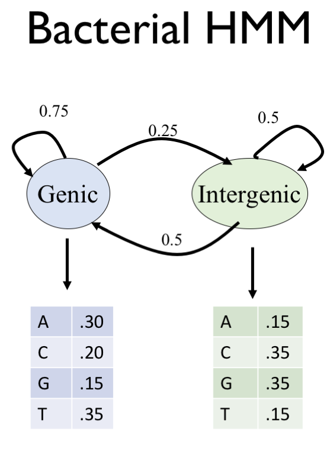

## Assignment 6: Functional Annotations
Assignment Date: Monday, March 4, 2019  
Due Date: Monday, March 11, 2019 @ 11:59pm  

### Assignment Overview

In this assignment, you will analyze annotation data and make different visualization in the language of your choice.
(We suggest Python, R, or perhaps Excel.) **Make sure to show your work/code in your writeup!** As before, any questions about the assignment should be posted to 
[Piazza](https://piazza.com/jhu/spring2019/en601749/home).


#### Question 1. De novo mutation analysis [10 pts]

For this question, we will be focusing on the de novo variants identified in this paper:<br>
[http://www.nature.com/articles/npjgenmed201627](http://www.nature.com/articles/npjgenmed201627)

Download the de novo variant positions from here (Supplementary Table S4):<br>
[http://www.nature.com/article-assets/npg/npjgenmed/2016/npjgenmed201627/extref/npjgenmed201627-s3.xlsx](http://www.nature.com/article-assets/npg/npjgenmed/2016/npjgenmed201627/extref/npjgenmed201627-s3.xlsx)

Download the annotation of regulatory variants from here:<br>
[ftp://ftp.ensembl.org/pub/release-87/regulation/homo_sapiens/homo_sapiens.GRCh38.Regulatory_Build.regulatory_features.20161111.gff.gz](ftp://ftp.ensembl.org/pub/release-87/regulation/homo_sapiens/homo_sapiens.GRCh38.Regulatory_Build.regulatory_features.20161111.gff.gz)

- Question 1a. How many variants are in protein coding genes? [Hint: convert xlsx to BED, then `bedtools`]

- Question 1b. How many variants are in *any* annotated regulatory regions? [Hint: `bedtools`]

- Question 1c. What type of annotated regulatory region has the most variants? [Hint: `bedtools`]

- Question 1d. Is this a statistically significant number of variants (P-value < 0.05)? [Hint: If you don't want to calculate this analytically, you can do an experiment. Try simulating the same number of variants as the original file 100 times, and see how many fall into this regulatory type. If at least this many variants fall into this feature type more than 5% of the trials, this is not statistically significant]


#### Question 2. More time series visualizations [10 pts]

- Question 2a. Using [the data](http://schatz-lab.org/teaching/exercises/rnaseq/rnaseq.1.expression/expression.txt) from assignment 5, question 2, visualize the expression data using t-SNE

- Question 2b. Using the same data, visualize the expression data using UMAP

- Question 2c. In a few sentences, compare and contrast the (1) heatmap, (2) PCA, (3) t-SNE and (4) UMAP results. Be sure to comment on understandability, relative positioning of clusters,
  runtime, and any other significant factors that you see


#### Question 3. Understanding HMMs [20 pts]

Consider this HMM describing genetic (G) and intergenic (I) sequences in a bacteria:<br>


- Question 3a. Compute the probability that this HMM emitted the sequence using the forward algorithm: `CAACATTGTCGCCATTGCTCAGGGATCTTCTGAACGCTC`.<br>
You may assume the sequence begins and ends in the intergenic state. Be sure to show the entire trellis for the calculation.

- Question 3b. Using the Viterbi algorithm, what is the most like parse of this sequence into genetic and intergenic states? Be sure to show the entire trellis including the bactracking

- Question 3c. Describe in a few sentences how you could modify the HMM to evalute the forward and reverse strands at the same time.

- Question 3d. Describe in a few sentences how you could modify the HMM to also consider a third state for "promotor". 
Other than nucleotide sequence, what other types of data might you want to include?

### Packaging

Upload a single PDF document to GradeScope.

### Resources

#### [BEDTools](http://bedtools.readthedocs.io/en/latest/) - Genome Arithmetic

Get bedtools from conda, if you haven't already.

```
conda install bedtools
```


